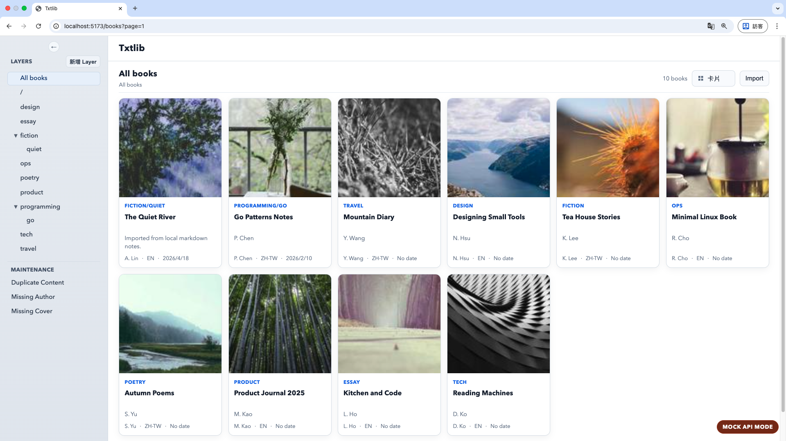

# PlainShelf

[](https://pkg.go.dev/github.com/voilelab/plainshelf)
[](https://github.com/voilelab/plainshelf/blob/main/LICENSE)
[](https://goreportcard.com/report/github.com/voilelab/plainshelf)

PlainShelf is a local-first personal reading library for plain text books.

It is designed for single-user local usage, with a filesystem-first data model and a web-based reading interface.

> Status: pre-alpha / early development  
> APIs, data layout, and UI behavior may still change.



---

## Goals

- Manage and read TXT books
- Keep user data in local, human-readable files
- Use stable internal book IDs independent from display titles
- Provide a local web UI for browsing, importing, organizing, and reading
- Keep runtime state rebuildable
- Stay friendly to backup tools and Git-based workflows

PlainShelf is currently TXT-focused. Other text-like formats may be explored later, but plain text reading is the primary use case.

---

## Non-goals

The following are not planned for the current v1 scope:

- EPUB support
- PDF support
- CBZ / CBR support
- DRM formats
- OCR
- Multi-user support
- Cloud sync
- Public sharing links
- Plugin system

PlainShelf is not intended to be a full Calibre replacement.

---

## Project Structure

```text
cmd/
├─ txtlib-srv/      # local server entrypoint
├─ txtlib-cli/      # experimental CLI entrypoint
└─ txtlib-gui/      # experimental Fyne GUI entrypoint

shelf/              # core library package
txtlib-srv/         # local HTTP server implementation
txtlib-gui/         # experimental Fyne GUI implementation
txtlib-frontend/    # Vue web frontend
internal/           # internal shared utilities
docs/               # design notes and documentation
```

The current primary development focus is:

1. `shelf`
2. `txtlib-srv`
3. `txtlib-frontend`

The CLI and Fyne GUI are experimental and may lag behind the main server/web workflow.

---

## Data Model

PlainShelf is filesystem-first.

A typical vault may look like this:

```text
lib/
├─ books/
└─ app/
```

### `books/`

Source of truth.

This contains user-owned data such as book metadata,
text files, covers, notes, and other long-lived files.

### `app/`

Runtime state.

---

## Development

### Run Only Frontend

```bash
cd txtlib-frontend
npm install

# use mock data
VITE_USE_MOCK_API=true npm run dev
```

### Run server

```bash
# build frontend
cd txtlib-frontend
npm install
npm run build
cd ..

# run server
mkdir workspace0
cp cmd/txtlib-srv/conf/config.yaml workspace0/
cd workspace0
go run ../cmd/txtlib-srv/main.go -conf config.yaml
```

### Run tests

```bash
go test ./...
```

---

## Naming

PlainShelf is the product and repository name.

Some internal packages and commands still use the older `txtlib` name.
They may be renamed later as the project stabilizes.

---

## License

BSD 3-Clause
