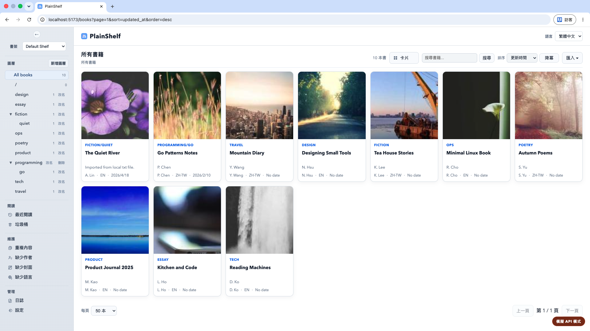

# PlainShelf

[](https://pkg.go.dev/github.com/voilelab/plainshelf)
[](https://github.com/voilelab/plainshelf/blob/main/LICENSE)
[](https://goreportcard.com/report/github.com/voilelab/plainshelf)

PlainShelf is a local-first personal reading library for lightweight reading content.

It is designed for single-user local usage, with a filesystem-first data model and a web-based reading interface.

> Status: pre-alpha / early development  
> APIs, data layout, and UI behavior may still change.



---

## Goals

- Manage and read TXT books (with Markdown and image support planned)
- Keep user data in local, human-readable files
- Use stable internal book IDs independent from display titles
- Provide a local web UI for browsing, importing, organizing, and reading
- Keep runtime state rebuildable
- Stay friendly to backup tools and Git-based workflows

PlainShelf currently focuses on TXT, with Markdown and image support planned next. Heavier formats (EPUB, PDF, …) remain out of scope.

---

## Non-goals

The following are not planned for the current v1 scope:

- EPUB support
- PDF support
- CBZ / CBR support
- DRM formats
- OCR
- Multi-user support
- Cloud sync
- Public sharing links
- Plugin system

PlainShelf is not intended to be a full Calibre replacement.

---

## Project Structure

```text
cmd/
└─ plainshelf-srv/  # local server entrypoint

shelf/              # core library package
server/             # local HTTP server implementation
frontend/           # Vue web frontend
frontend/android/   # Capacitor Android app (experimental)
internal/           # internal shared utilities
desktop/            # Wails desktop client
```

The current primary development focus is:

1. `shelf`
2. `server`
3. `frontend`

---

## Data Model

PlainShelf is filesystem-first.

A typical vault may look like this:

```text
{shelf}/
├─ books/
│  ├─ {book1-folder}.bookpkg/
│  ├─ {layer1}/
│  │  └─ {book2-folder}.bookpkg/
│  └─ {layer2}/
│     └─ {layer3}/
│        └─ {book3-folder}.bookpkg/
└─ app/
   ├─ library.lock
   └─ tmp/
```

### `books/`

Source of truth.

This contains user-owned data such as book metadata,
text files, covers, notes, and other long-lived files.

```text
{book-folder}.bookpkg/
├─ book.json
├─ CURRENT_VERSION_LOCATION.txt
├─ cover.(jpg|png|webp)
└─ sources/
   └─ {source-id}/
      ├─ source.txt
      └─ meta.json
```

### `app/`

Runtime state.

---

## Install

### Desktop (macOS, Apple Silicon)

Install the desktop app via Homebrew:

```bash
brew tap voilelab/plainshelf https://github.com/voilelab/plainshelf
brew install --cask voilelab/plainshelf/plainshelf
```

For the server binary, Docker image, or other platforms, see
[docs/installation.md](docs/installation.md).

---

## Development

### Run Only Frontend

```bash
cd frontend
npm install

# use mock data
VITE_USE_MOCK_API=true npm run dev
```

### Run server

```bash
# build frontend
cd frontend
npm install
npm run build
cd ..

# run server
mkdir workspace
cp cmd/plainshelf-srv/conf/config.yaml workspace/
cd workspace
go run ../cmd/plainshelf-srv/main.go -conf config.yaml
```

The default development config listens on `127.0.0.1:20000`, stores shelf data and application store data under the current working directory, and enables `local_token` security for mutating `/api` requests. The server generates an ephemeral token at startup, injects it into the served frontend, and accepts it via `X-PlainShelf-Token` or `Authorization: Bearer <token>`.

### Run server with Docker

Build the Ubuntu 24.04-based container image from the repository root:

```bash
docker build -t plainshelf .
```

Start the server on <http://localhost:20000> with persistent application data in a Docker volume:

```bash
docker run --rm \
  --name plainshelf \
  -p 127.0.0.1:20000:20000 \
  -v plainshelf-data:/data \
  plainshelf
```

The image uses `docker/config.yaml`, which listens on `0.0.0.0:20000`
inside the container, stores data in `/data/shelf` and `/data/store`, and explicitly sets `app_conf.security.mode: "none"` for compatibility with local-only port publishing. Keep the documented `127.0.0.1:20000:20000` port binding or put the container behind a trusted authentication boundary before exposing it beyond the local machine.
To use a custom server config, mount it over `/etc/plainshelf/config.yaml`:

```bash
docker run --rm \
  --name plainshelf \
  -p 127.0.0.1:20000:20000 \
  -v plainshelf-data:/data \
  -v "$PWD/path/to/config.yaml:/etc/plainshelf/config.yaml:ro" \
  plainshelf
```

### Run the desktop app

The desktop client is built with Wails.

```bash
npm --prefix frontend install  # first time only
just run-desktop
```

### Build the mobile app (Android, experimental)

> **Experimental.** The Android app is early and less polished than the web
> and desktop clients; expect rough edges and behavior changes. Reading
> progress is stored on the device only and does not sync back to the server.

The mobile client reuses the same Vue frontend, wrapped with
[Capacitor](https://capacitorjs.com/). It runs as a client of a PlainShelf
server: on first launch it asks for the server URL, an optional access token,
and a shelf, then caches downloaded books and reading progress locally for
offline reading. You can change these later under **Settings → Connection**.

Prerequisites: Android SDK and JDK 17 (Android Studio bundles both).

```bash
npm --prefix frontend install   # first time only

# One-time: generate the native android/ project under frontend/
just mobile-add-android

# Build a debug APK (frontend/android/app/build/outputs/apk/debug/app-debug.apk)
just build-mobile-android

# Or open the project in Android Studio to run on a device/emulator
just open-mobile-android
```

App icons and splash screens are generated from the source images in
`frontend/assets/` — after changing them, regenerate with
`npx capacitor-assets generate --android` (run inside `frontend/`).

Because the phone connects over the network, the server must listen on a
LAN-reachable address rather than `127.0.0.1` (set the listen address in
`cmd/plainshelf-srv/conf/config.yaml`). The app makes its API calls through
native HTTP, so browsing works over plain HTTP without adding the app to the
server's `app_conf.security.allowed_origins`. Reading works without a token; an
access token is only needed for edits. If the library fails to load, confirm the
server is reachable from the phone — open `http://<server-ip>:20000/health` in
the phone's browser and check it returns `1`.

### Run tests

```bash
npm --prefix frontend install  # first time only
just test-go
```

---

## License

BSD 3-Clause
